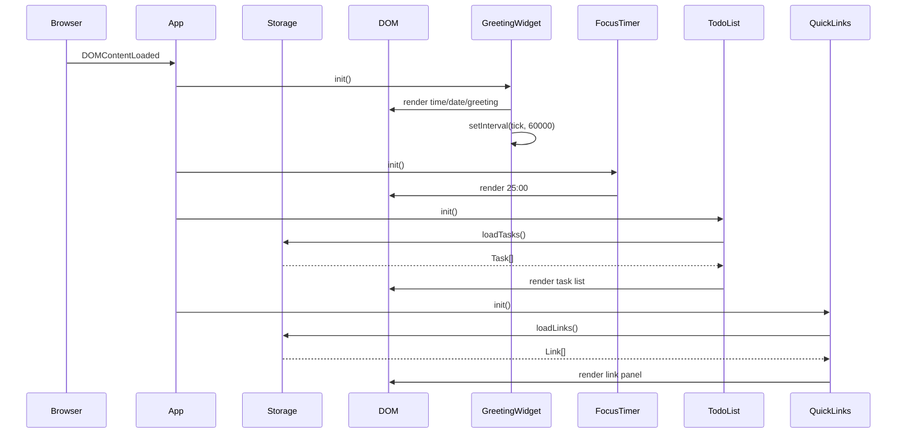
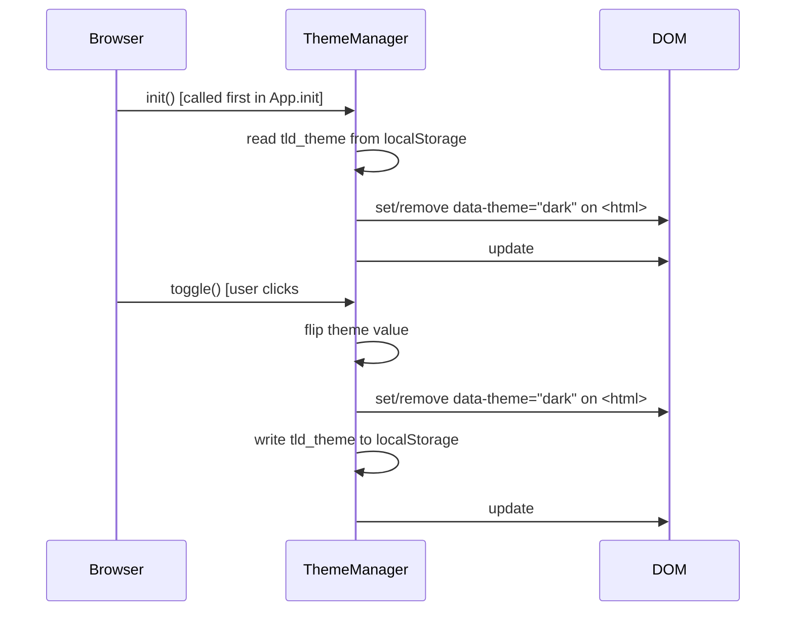

# Design Document

## Todo List Life Dashboard

---

## Overview

The Todo List Life Dashboard is a single-page, client-side web application that acts as a personal productivity hub. It is delivered as three files: `index.html`, `css/style.css`, and `js/app.js`. There is no build step, no framework, and no backend — the page opens directly in any modern browser.

The application is composed of four widgets arranged in a responsive card-based layout:

| Widget | Purpose |
|---|---|
| Greeting Widget | Shows current time, date, and a time-of-day greeting |
| Focus Timer | 25-minute Pomodoro countdown with start / stop / reset |
| To-Do List | Add, edit, complete, and delete tasks |
| Quick Links | User-defined shortcut buttons that open URLs in a new tab |

All mutable state (tasks and links) is persisted to `localStorage`. The timer and greeting are ephemeral — they are re-initialised from the system clock on every page load.

---

## Architecture

The application follows a **module-revealing pattern** inside a single IIFE (Immediately Invoked Function Expression) in `js/app.js`. Each widget is implemented as a self-contained module object with `init`, `render`, and event-handler functions. Modules communicate only through the shared `Storage` utility — there is no global mutable state outside of each module's closure.

```
index.html
  └── css/style.css          (all visual styles)
  └── js/app.js
        ├── Storage           (localStorage read/write helpers)
        ├── GreetingWidget    (time, date, greeting)
        ├── FocusTimer        (countdown logic)
        ├── TodoList          (task CRUD + persistence)
        ├── QuickLinks        (link CRUD + persistence)
        └── App.init()        (bootstraps all modules on DOMContentLoaded)
```

### Execution Flow



---

## Components and Interfaces

### Storage Module

Thin wrapper around `localStorage` that serialises/deserialises JSON and provides typed accessors.

```js
const Storage = {
  KEYS: {
    TASKS: 'tld_tasks',
    LINKS: 'tld_links',
  },
  get(key) { /* JSON.parse(localStorage.getItem(key)) ?? [] */ },
  set(key, value) { /* localStorage.setItem(key, JSON.stringify(value)) */ },
};
```

### GreetingWidget Module

Responsible for the top-of-page greeting card.

```js
const GreetingWidget = {
  init()          // Renders once, then starts a 60-second interval
  tick()          // Called by interval; updates time display
  formatTime(date)  // Returns "HH:MM" string
  formatDate(date)  // Returns "Weekday, DD Month YYYY" string
  getGreeting(hour) // Returns greeting string based on hour [0–23]
  render()        // Writes to DOM elements
};
```

**Public functions (pure, testable):**
- `formatTime(date: Date): string`
- `formatDate(date: Date): string`
- `getGreeting(hour: number): string`

### FocusTimer Module

Manages the countdown state machine.

```js
const FocusTimer = {
  DURATION_SECONDS: 1500,  // 25 * 60
  remaining: 1500,
  intervalId: null,
  state: 'idle',           // 'idle' | 'running' | 'paused' | 'done'

  init()           // Renders initial state, binds button events
  start()          // Sets state to 'running', calls setInterval(tick, 1000)
  stop()           // Clears interval, sets state to 'paused'
  reset()          // Clears interval, restores remaining to DURATION_SECONDS, state to 'idle'
  tick()           // Decrements remaining; if 0, calls onComplete()
  onComplete()     // Clears interval, sets state to 'done', applies done class
  formatSeconds(s) // Returns "MM:SS" string
  render()         // Updates timer display element
};
```

**Public functions (pure, testable):**
- `formatSeconds(seconds: number): string`

### TodoList Module

Manages the task collection and its DOM representation.

```js
const TodoList = {
  tasks: [],       // Task[]

  init()                    // Loads from Storage, renders, binds form submit
  addTask(description)      // Validates, creates Task, saves, renders
  editTask(id, newDescription) // Validates, updates Task, saves, renders
  toggleTask(id)            // Flips completed flag, saves, renders
  deleteTask(id)            // Removes Task by id, saves, renders
  save()                    // Writes this.tasks to Storage
  load()                    // Reads from Storage into this.tasks
  render()                  // Rebuilds task list DOM
  renderTask(task)          // Returns a DOM element for one Task
};
```

### QuickLinks Module

Manages the link collection and its DOM representation.

```js
const QuickLinks = {
  links: [],       // Link[]

  init()                    // Loads from Storage, renders, binds form submit
  addLink(label, url)       // Validates, creates Link, saves, renders
  deleteLink(id)            // Removes Link by id, saves, renders
  save()                    // Writes this.links to Storage
  load()                    // Reads from Storage into this.links
  render()                  // Rebuilds link panel DOM
  renderLink(link)          // Returns a DOM element for one Link
  validateForm(label, url)  // Returns { valid, errors } object
};
```

---

## Data Models

### Task

```js
/**
 * @typedef {Object} Task
 * @property {string} id          - Unique identifier (crypto.randomUUID() or Date.now().toString())
 * @property {string} description - Non-empty task text
 * @property {boolean} completed  - Completion state
 * @property {number} createdAt   - Unix timestamp (ms) of creation
 */
```

Example:
```json
{
  "id": "1720000000000",
  "description": "Write design document",
  "completed": false,
  "createdAt": 1720000000000
}
```

### Link

```js
/**
 * @typedef {Object} Link
 * @property {string} id    - Unique identifier
 * @property {string} label - Display text for the button
 * @property {string} url   - Full URL (must be non-empty; https:// recommended)
 */
```

Example:
```json
{
  "id": "1720000001000",
  "label": "GitHub",
  "url": "https://github.com"
}
```

### localStorage Key Schema

| Key | Type | Description |
|---|---|---|
| `tld_tasks` | `Task[]` (JSON) | Ordered array of all task objects |
| `tld_links` | `Link[]` (JSON) | Ordered array of all link objects |

Both keys store JSON-serialised arrays. A missing key is treated as an empty array (`[]`). No migration logic is required for v1.

---

## Layout

The page uses a two-column CSS Grid layout on wide viewports, collapsing to a single column on narrow screens.

```
┌─────────────────────────────────────────────────────┐
│                  Greeting Widget                    │  ← full width, top
├──────────────────────────┬──────────────────────────┤
│      Focus Timer         │      Quick Links         │  ← 2-column row
├──────────────────────────┴──────────────────────────┤
│                    To-Do List                       │  ← full width, bottom
└─────────────────────────────────────────────────────┘
```

Each widget is a `<section>` element with a shared `.widget` CSS class that provides card styling (background, border-radius, padding, box-shadow). The grid is defined on a `.dashboard-grid` container in `index.html`.

### DOM Structure Sketch

```html
<body>
  <main class="dashboard-grid">
    <section id="greeting"   class="widget widget--greeting">…</section>
    <section id="timer"      class="widget widget--timer">…</section>
    <section id="links"      class="widget widget--links">…</section>
    <section id="todos"      class="widget widget--todos">…</section>
  </main>
</body>
```

---

## Timer Implementation

The Focus Timer uses `setInterval` with a 1-second interval. The canonical state is `remaining` (integer seconds). The display is derived from `remaining` on every tick via `formatSeconds`.

```
State machine:

  idle ──[start]──► running ──[stop]──► paused
   ▲                   │                  │
   │                   │[reset]           │[start]
   │◄──────────────────┘                  │
   │◄─────────────────────────────────────┘
   │
  idle ◄──[reset from paused]
  done ◄──[remaining reaches 0]
```

- `start()` guards against double-start by checking `state !== 'running'`.
- `reset()` calls `clearInterval` regardless of current state.
- `onComplete()` adds a `.timer--done` CSS class to the timer element for visual indication (e.g., colour change or pulsing animation).

---

## Greeting Logic

```js
function getGreeting(hour) {
  if (hour >= 5  && hour <= 11) return 'Good Morning';
  if (hour >= 12 && hour <= 17) return 'Good Afternoon';
  if (hour >= 18 && hour <= 21) return 'Good Evening';
  return 'Good Night'; // 22–23 and 0–4
}
```

The `tick()` function reads `new Date()` on each call, so the greeting updates automatically at the minute boundary without requiring a page reload.

---

## Correctness Properties

*A property is a characteristic or behavior that should hold true across all valid executions of a system — essentially, a formal statement about what the system should do. Properties serve as the bridge between human-readable specifications and machine-verifiable correctness guarantees.*

### Property 1: Time format correctness

*For any* `Date` object, `formatTime(date)` SHALL return a string matching the pattern `HH:MM` where HH is the zero-padded 24-hour hour and MM is the zero-padded minute.

**Validates: Requirements 1.1**

---

### Property 2: Date format completeness

*For any* `Date` object, `formatDate(date)` SHALL return a string that contains a valid English weekday name, the numeric day of the month, a valid English month name, and the four-digit year.

**Validates: Requirements 1.2**

---

### Property 3: Greeting correctness for all hours

*For any* integer hour in [0, 23], `getGreeting(hour)` SHALL return exactly one of `"Good Morning"`, `"Good Afternoon"`, `"Good Evening"`, or `"Good Night"`, and the returned value SHALL match the hour range defined in the requirements (morning: 5–11, afternoon: 12–17, evening: 18–21, night: 22–4).

**Validates: Requirements 1.3, 1.4, 1.5, 1.6**

---

### Property 4: Timer display format correctness

*For any* integer seconds value in [0, 1500], `formatSeconds(seconds)` SHALL return a string matching the pattern `MM:SS` where MM is the zero-padded minutes and SS is the zero-padded remaining seconds.

**Validates: Requirements 2.7**

---

### Property 5: Adding a valid task grows the list

*For any* non-empty, non-whitespace-only string, calling `addTask(description)` SHALL increase the length of the task collection by exactly one, and the new task SHALL appear in the rendered list with the submitted description.

**Validates: Requirements 3.2**

---

### Property 6: Whitespace-only task descriptions are rejected

*For any* string composed entirely of whitespace characters (spaces, tabs, newlines), calling `addTask(description)` SHALL leave the task collection unchanged.

**Validates: Requirements 3.4**

---

### Property 7: Input field is cleared after a successful task addition

*For any* valid (non-empty) task description submitted via the form, the text input field SHALL be empty immediately after the task is added.

**Validates: Requirements 3.3**

---

### Property 8: Editing a task with a valid description updates it

*For any* existing task and any non-empty, non-whitespace-only new description, calling `editTask(id, newDescription)` SHALL update that task's description to the new value, leaving all other tasks unchanged.

**Validates: Requirements 4.3**

---

### Property 9: Editing a task with a whitespace-only value discards the change

*For any* existing task and any whitespace-only string, calling `editTask(id, whitespaceValue)` SHALL leave the task's description unchanged.

**Validates: Requirements 4.4**

---

### Property 10: Completion toggle is a round-trip

*For any* task, calling `toggleTask(id)` twice in succession SHALL return the task to its original `completed` state (i.e., toggle is its own inverse).

**Validates: Requirements 5.2, 5.3**

---

### Property 11: Deleting a task removes it from the collection

*For any* non-empty task collection and any task `t` in that collection, calling `deleteTask(t.id)` SHALL result in a collection that does not contain `t` and whose length is exactly one less than before.

**Validates: Requirements 5.5**

---

### Property 12: Task collection persistence round-trip

*For any* sequence of task mutations (add, edit, toggle, delete), the state written to `localStorage` under `tld_tasks` SHALL equal the current in-memory task collection, and re-initialising `TodoList` from that `localStorage` state SHALL produce a rendered list identical to the pre-reload state.

**Validates: Requirements 6.1, 6.2**

---

### Property 13: Link collection render and persistence round-trip

*For any* non-empty link collection written to `localStorage` under `tld_links`, initialising `QuickLinks` SHALL render exactly one labelled button per link with the correct label text, and any add or delete mutation SHALL be immediately reflected in `localStorage`.

**Validates: Requirements 7.1, 7.3, 8.6**

---

### Property 14: Adding a valid link grows the panel

*For any* non-empty label and non-empty URL, calling `addLink(label, url)` SHALL increase the length of the link collection by exactly one, and the new link button SHALL appear in the rendered panel with the correct label.

**Validates: Requirements 8.2**

---

### Property 15: Invalid link submissions are rejected

*For any* submission where the label is empty, the URL is empty, or both are empty, calling `addLink` SHALL leave the link collection unchanged and the `validateForm` function SHALL return a non-empty `errors` array identifying the missing field(s).

**Validates: Requirements 8.3**

---

### Property 16: Deleting a link removes it from the panel

*For any* non-empty link collection and any link `l` in that collection, calling `deleteLink(l.id)` SHALL result in a collection that does not contain `l` and whose length is exactly one less than before.

**Validates: Requirements 8.5**

---

## Error Handling

| Scenario | Handling |
|---|---|
| `localStorage` read returns `null` | `Storage.get()` returns `[]`; widgets render empty state without error |
| `localStorage` is full (QuotaExceededError) | `Storage.set()` wraps `setItem` in a try/catch; logs a console warning; UI state is not rolled back (last successful save is preserved) |
| `crypto.randomUUID()` unavailable (very old browser) | Falls back to `Date.now().toString() + Math.random()` for ID generation |
| Timer `setInterval` drift | Acceptable for a Pomodoro timer; no compensation needed |
| Link URL missing protocol | The URL is stored as-entered; the browser handles navigation. No automatic `https://` injection in v1 |
| Edit confirmed with whitespace | Silently discarded; original description restored (see Property 9) |
| Task/link not found by ID | `editTask`, `toggleTask`, `deleteTask`, `deleteLink` are no-ops if the ID does not exist; no error is thrown |

---

## Testing Strategy

This feature is a client-side JavaScript application with pure utility functions (formatters, greeting logic, validation) and stateful modules (TodoList, QuickLinks, FocusTimer). Property-based testing is appropriate for the pure functions and the data-manipulation logic; example-based tests cover specific UI interactions and edge cases.

### Property-Based Testing

**Library:** [fast-check](https://github.com/dubzzz/fast-check) (JavaScript, runs in Node.js with jsdom or in-browser)

Each property test runs a minimum of **100 iterations**.

Each test is tagged with a comment in the format:
`// Feature: todo-life-dashboard, Property N: <property text>`

Properties to implement as property-based tests:
- Property 1: `formatTime` — arbitrary `Date` → HH:MM
- Property 2: `formatDate` — arbitrary `Date` → contains weekday, day, month, year
- Property 3: `getGreeting` — arbitrary hour [0,23] → correct greeting string
- Property 4: `formatSeconds` — arbitrary integer [0,1500] → MM:SS
- Property 5: `addTask` with valid description → list grows by 1
- Property 6: `addTask` with whitespace-only → list unchanged
- Property 7: `addTask` valid → input field cleared
- Property 8: `editTask` with valid new description → description updated
- Property 9: `editTask` with whitespace-only → original preserved
- Property 10: `toggleTask` twice → original completed state restored
- Property 11: `deleteTask` → task removed, length decremented
- Property 12: Task persistence round-trip (mock localStorage)
- Property 13: Link render and persistence round-trip (mock localStorage)
- Property 14: `addLink` with valid inputs → panel grows by 1
- Property 15: `addLink` with invalid inputs → collection unchanged, errors returned
- Property 16: `deleteLink` → link removed, length decremented

### Unit / Example-Based Tests

Example-based tests cover:
- Timer initial state is `25:00`
- Start → advance clock N seconds → display shows `25:00 - N seconds`
- Stop → clock advances → display unchanged
- Reset → display returns to `25:00`
- Timer reaches `00:00` → `.timer--done` class applied
- Edit control appears for each task
- Edit control pre-fills input with current description
- Link button opens correct URL in new tab (`window.open` mock)
- Empty localStorage → both widgets render without throwing
- Body font-size computed style ≥ 14px

### Integration / Smoke Tests

- Page loads without JavaScript errors in Chrome, Firefox, Edge, Safari
- No network requests are made (verified via browser DevTools / test spy)
- All four widgets are present in the DOM after load
- Page load time < 2 seconds (measured with Lighthouse or manual timing)


---

## Feature Extensions (Requirements 11–13)

The three sections below extend the existing design with Light/Dark Mode, Custom Name in Greeting, and Custom Pomodoro Duration. All new state is persisted to `localStorage` only. No new files are introduced — all changes land in `index.html`, `css/style.css`, and `js/app.js`.

---

## Feature 11: Light / Dark Mode

### Overview

A `ThemeManager` module is added inside the IIFE in `js/app.js`. It owns the single `data-theme` attribute on the `<html>` element and the `tld_theme` localStorage key. CSS custom properties defined on `:root` supply the light theme; a `[data-theme="dark"]` selector block overrides those same properties for the dark theme. Because the attribute lives on `<html>`, every widget inherits the correct colour tokens automatically — no per-widget theme logic is needed.

### Architecture

```
ThemeManager
  ├── STORAGE_KEY = 'tld_theme'
  ├── init()      — reads tld_theme from localStorage, applies theme before DOMContentLoaded renders widgets
  ├── toggle()    — flips active theme, saves to localStorage, updates #theme-toggle label/icon
  └── _apply(theme) — sets or removes data-theme="dark" on <html>; updates button label
```

`ThemeManager.init()` is called **first** inside `App.init()` (before any widget `init()`) so the correct theme is applied before any widget paints.

### Component Interface

```js
const ThemeManager = {
  STORAGE_KEY: 'tld_theme',   // 'light' | 'dark'

  init()          // Reads saved theme; falls back to 'light'; calls _apply()
  toggle()        // Flips theme, saves, calls _apply()
  _apply(theme)   // Sets/removes data-theme="dark" on document.documentElement; updates button text
};
```

### DOM Changes (`index.html`)

A `#theme-toggle` button is added in a `<header>` element above `<main>`:

```html
<header class="app-header">
  <button id="theme-toggle" aria-label="Toggle dark mode">🌙 Dark</button>
</header>
```

The button label/icon is updated by `_apply()`:
- Light theme active → button shows `"🌙 Dark"`
- Dark theme active → button shows `"☀️ Light"`

### CSS Changes (`css/style.css`)

Light theme variables are declared on `:root` (existing variables remain; new ones are added as needed). Dark theme overrides are declared in a single `[data-theme="dark"]` block:

```css
:root {
  --color-bg: #f5f5f5;
  --color-surface: #ffffff;
  --color-text: #1a1a1a;
  --color-text-muted: #555555;
  --color-border: #dddddd;
  --color-accent: #4a90d9;
  /* …existing variables… */
}

[data-theme="dark"] {
  --color-bg: #1a1a2e;
  --color-surface: #16213e;
  --color-text: #e0e0e0;
  --color-text-muted: #a0a0b0;
  --color-border: #2a2a4a;
  --color-accent: #6ab0f5;
}
```

All existing colour references in `css/style.css` are updated to use `var(--color-*)` tokens so they respond to the theme switch automatically.

### Execution Flow



### localStorage Key

| Key | Type | Description |
|---|---|---|
| `tld_theme` | `"light" \| "dark"` | Active theme; absent key defaults to `"light"` |

---

## Feature 12: Custom Name in Greeting

### Overview

The `GreetingWidget` module is extended with `name` state and two new methods: `setName(name)` and `clearName()`. The `render()` function is updated to include the name when one is saved. An inline edit control (pencil icon) next to the greeting message reveals a text input and save/clear buttons. The name is persisted under `tld_name` in localStorage.

### Architecture

```
GreetingWidget (extended)
  ├── name: string | null     — loaded from tld_name on init
  ├── STORAGE_KEY_NAME = 'tld_name'
  ├── setName(name)           — trims input; if non-empty saves to localStorage and re-renders;
  │                             if empty/whitespace-only calls clearName()
  ├── clearName()             — removes tld_name from localStorage, sets name = null, re-renders
  ├── render()                — updated: appends ", [Name]!" when name is set
  └── init()                  — updated: reads tld_name from localStorage before first render
```

### Greeting Format

```js
// name is null or empty
getGreeting(hour)  →  "Good Morning!"

// name is "Alex"
getGreeting(hour)  →  "Good Morning, Alex!"
```

The `render()` function composes the greeting message element content as:

```js
const base = getGreeting(new Date().getHours());
greetingMessageEl.textContent = name ? `${base}, ${name}!` : `${base}!`;
```

### Inline Edit Control

The greeting widget gains an edit affordance rendered alongside `#greeting-message`:

```html
<!-- rendered by GreetingWidget.render() or present in static HTML -->
<p id="greeting-message"></p>
<button id="greeting-edit-btn" aria-label="Edit name">✏️</button>

<!-- revealed on edit-btn click -->
<div id="greeting-name-form" hidden>
  <input id="greeting-name-input" type="text" placeholder="Your name" maxlength="50" />
  <button id="greeting-name-save">Save</button>
  <button id="greeting-name-clear">Clear</button>
</div>
```

Interaction flow:
1. User clicks `#greeting-edit-btn` → `#greeting-name-form` is shown; input is pre-filled with current name.
2. User types a name and clicks **Save** → `setName()` is called; form is hidden; greeting updates.
3. User clicks **Clear** → `clearName()` is called; form is hidden; greeting reverts to no-name format.
4. Whitespace-only input on Save → treated as empty; `clearName()` is called.

### localStorage Key

| Key | Type | Description |
|---|---|---|
| `tld_name` | `string` | User's custom greeting name; absent key means no name |

---

## Feature 13: Custom Pomodoro Duration

### Overview

The `FocusTimer` module is extended with `customDuration` state and a duration-setting UI. A number input (`#timer-duration-input`) and a set button (`#timer-duration-set`) are added to the timer widget. Valid durations are integers in [1, 60] minutes. The input and button are disabled while the timer is running or paused. On a valid submission, `DURATION_SECONDS` is updated, `reset()` is called, and the new value is saved to localStorage under `tld_timer_duration`. `FocusTimer.init()` reads the saved duration on startup, falling back to 1500 (25 min).

### Architecture

```
FocusTimer (extended)
  ├── DURATION_SECONDS: number   — mutable; updated on valid custom duration submit
  ├── customDuration: number     — current duration in minutes (mirrors DURATION_SECONDS / 60)
  ├── STORAGE_KEY_DURATION = 'tld_timer_duration'
  ├── setDuration(minutes)       — validates range [1,60]; if valid: updates DURATION_SECONDS,
  │                                saves to localStorage, calls reset(); if invalid: shows error
  ├── _updateDurationControls()  — enables/disables #timer-duration-input and #timer-duration-set
  │                                based on current state ('running' | 'paused' → disabled)
  ├── init()                     — updated: reads tld_timer_duration; falls back to 25;
  │                                calls _updateDurationControls()
  ├── start()                    — updated: calls _updateDurationControls() after state change
  ├── stop()                     — updated: calls _updateDurationControls() after state change
  ├── reset()                    — updated: calls _updateDurationControls() after state change
  └── onComplete()               — updated: calls _updateDurationControls() after state change
```

### Validation Logic

```js
function setDuration(minutes) {
  const n = parseInt(minutes, 10);
  if (isNaN(n) || n < 1 || n > 60) {
    document.getElementById('timer-duration-error').textContent =
      'Please enter a whole number between 1 and 60.';
    return;
  }
  document.getElementById('timer-duration-error').textContent = '';
  DURATION_SECONDS = n * 60;
  customDuration = n;
  Storage.set(Storage.KEYS.TIMER_DURATION, n);
  reset();
}
```

### DOM Changes (`index.html`)

The timer widget gains a duration-setting row below the existing controls:

```html
<section id="timer" class="widget widget--timer">
  <div id="timer-display">25:00</div>
  <div class="timer-controls">
    <button id="timer-start">Start</button>
    <button id="timer-stop">Stop</button>
    <button id="timer-reset">Reset</button>
  </div>
  <!-- new duration row -->
  <div class="timer-duration-row">
    <label for="timer-duration-input">Duration (min):</label>
    <input id="timer-duration-input" type="number" min="1" max="60" value="25" />
    <button id="timer-duration-set">Set</button>
  </div>
  <p id="timer-duration-error" class="error-message" aria-live="polite"></p>
</section>
```

### Control Enable/Disable Logic

```
state === 'running' or 'paused'  →  #timer-duration-input.disabled = true
                                     #timer-duration-set.disabled   = true

state === 'idle' or 'done'       →  #timer-duration-input.disabled = false
                                     #timer-duration-set.disabled   = false
```

`_updateDurationControls()` is called at the end of every state transition (`start`, `stop`, `reset`, `onComplete`, `init`).

### Storage Module Update

`Storage.KEYS` gains a new constant:

```js
KEYS: {
  TASKS:          'tld_tasks',
  LINKS:          'tld_links',
  THEME:          'tld_theme',
  NAME:           'tld_name',
  TIMER_DURATION: 'tld_timer_duration',
}
```

### localStorage Key

| Key | Type | Description |
|---|---|---|
| `tld_timer_duration` | `number` (integer, minutes) | Saved timer duration; absent key defaults to 25 |

---

## Updated localStorage Key Schema

The full key schema including all new keys:

| Key | Type | Description |
|---|---|---|
| `tld_tasks` | `Task[]` (JSON) | Ordered array of all task objects |
| `tld_links` | `Link[]` (JSON) | Ordered array of all link objects |
| `tld_theme` | `"light" \| "dark"` | Active theme; absent → `"light"` |
| `tld_name` | `string` | User's custom greeting name; absent → no name |
| `tld_timer_duration` | `number` (integer, minutes) | Timer duration; absent → 25 |

---

## New Correctness Properties (Requirements 11–13)

*These properties extend the existing Correctness Properties section (Properties 1–16). Numbering continues from Property 17.*

### Property 17: Theme toggle is its own inverse

*For any* starting theme state (`"light"` or `"dark"`), calling `ThemeManager.toggle()` twice in succession SHALL return the `<html>` element's `data-theme` attribute to its original value (i.e., toggle is its own inverse).

**Validates: Requirements 11.2, 11.3**

---

### Property 18: Theme toggle persists to localStorage

*For any* call to `ThemeManager.toggle()`, the value written to `localStorage` under `tld_theme` SHALL equal the theme that is now active on the `<html>` element.

**Validates: Requirements 11.4**

---

### Property 19: Theme init reads from localStorage

*For any* valid theme value (`"light"` or `"dark"`) stored in `tld_theme`, calling `ThemeManager.init()` SHALL apply that theme to the `<html>` element (i.e., `data-theme` is set to `"dark"` when stored value is `"dark"`, and absent or `"light"` when stored value is `"light"`).

**Validates: Requirements 11.5**

---

### Property 20: Greeting with name follows correct format

*For any* non-empty, non-whitespace-only name string and any integer hour in [0, 23], the greeting message produced by `GreetingWidget.render()` SHALL match the pattern `"[getGreeting(hour)], [trimmedName]!"` — containing the correct time-of-day greeting, a comma-space separator, the trimmed name, and a trailing exclamation mark.

**Validates: Requirements 12.2**

---

### Property 21: Name persistence round-trip

*For any* string input to `GreetingWidget.setName()`:
- If the trimmed value is non-empty, `localStorage` under `tld_name` SHALL equal the trimmed name.
- If the trimmed value is empty (whitespace-only or empty string), `localStorage` SHALL not contain a non-empty value under `tld_name`, and the greeting SHALL use the no-name format.

**Validates: Requirements 12.5, 12.7**

---

### Property 22: Custom duration display correctness

*For any* integer `d` in [1, 60], after `FocusTimer.setDuration(d)` completes successfully, the timer display element SHALL show `formatSeconds(d * 60)` (i.e., the new duration in MM:SS format with seconds at 00).

**Validates: Requirements 13.2**

---

### Property 23: Custom duration persistence

*For any* integer `d` in [1, 60], after `FocusTimer.setDuration(d)` completes successfully, `localStorage` under `tld_timer_duration` SHALL equal `d`.

**Validates: Requirements 13.3**

---

### Property 24: Custom duration init from localStorage

*For any* integer `d` in [1, 60] stored in `tld_timer_duration`, calling `FocusTimer.init()` SHALL initialise `DURATION_SECONDS` to `d * 60` and the timer display SHALL show `formatSeconds(d * 60)`.

**Validates: Requirements 13.4**

---

### Property 25: Invalid duration is rejected

*For any* integer `d` where `d < 1` or `d > 60`, calling `FocusTimer.setDuration(d)` SHALL leave `DURATION_SECONDS` unchanged, SHALL not write to `localStorage`, and SHALL display a non-empty validation message in `#timer-duration-error`.

**Validates: Requirements 13.6**

---

### Property 26: Duration control disabled iff timer is active

*For any* timer state, the `#timer-duration-input` and `#timer-duration-set` controls SHALL be disabled if and only if the current state is `"running"` or `"paused"`, and SHALL be enabled when the state is `"idle"` or `"done"`.

**Validates: Requirements 13.7, 13.8**

---

## Updated Testing Strategy (Requirements 11–13)

The dual testing approach (property-based + example-based) from the original Testing Strategy section applies to the new features. The additions below supplement the existing test lists.

### New Property-Based Tests

Using [fast-check](https://github.com/dubzzz/fast-check), minimum 100 iterations each, tagged with:
`// Feature: todo-life-dashboard, Property N: <property text>`

- **Property 17**: `ThemeManager.toggle()` twice → original theme restored
- **Property 18**: `ThemeManager.toggle()` → `localStorage['tld_theme']` matches active theme
- **Property 19**: Any valid `tld_theme` in localStorage → `ThemeManager.init()` applies it
- **Property 20**: Any valid name + any hour [0,23] → greeting matches `"[greeting], [name]!"` pattern
- **Property 21**: Any name input → trimmed empty → no-name format; trimmed non-empty → saved to `tld_name`
- **Property 22**: Any `d` in [1,60] → `setDuration(d)` → display shows `formatSeconds(d * 60)`
- **Property 23**: Any `d` in [1,60] → `setDuration(d)` → `localStorage['tld_timer_duration'] === d`
- **Property 24**: Any `d` in [1,60] in localStorage → `FocusTimer.init()` → display shows `formatSeconds(d * 60)`
- **Property 25**: Any `d` outside [1,60] → `setDuration(d)` → `DURATION_SECONDS` unchanged, error shown
- **Property 26**: Any timer state → controls disabled iff state is `'running'` or `'paused'`

### New Example-Based Tests

- `#theme-toggle` button exists in the DOM after page load
- Clicking `#theme-toggle` from light mode adds `data-theme="dark"` to `<html>`
- Clicking `#theme-toggle` from dark mode removes `data-theme="dark"` from `<html>`
- `#greeting-edit-btn` exists in the greeting widget
- Clicking `#greeting-edit-btn` reveals `#greeting-name-form`
- Clicking **Clear** in the name form hides the form and reverts greeting to no-name format
- `#timer-duration-input` and `#timer-duration-set` exist in the timer widget
- With no `tld_theme` in localStorage, `ThemeManager.init()` applies light theme (no `data-theme="dark"`)
- With no `tld_name` in localStorage, greeting does not contain a comma-separated name
- With no `tld_timer_duration` in localStorage, `FocusTimer.init()` shows `25:00`
